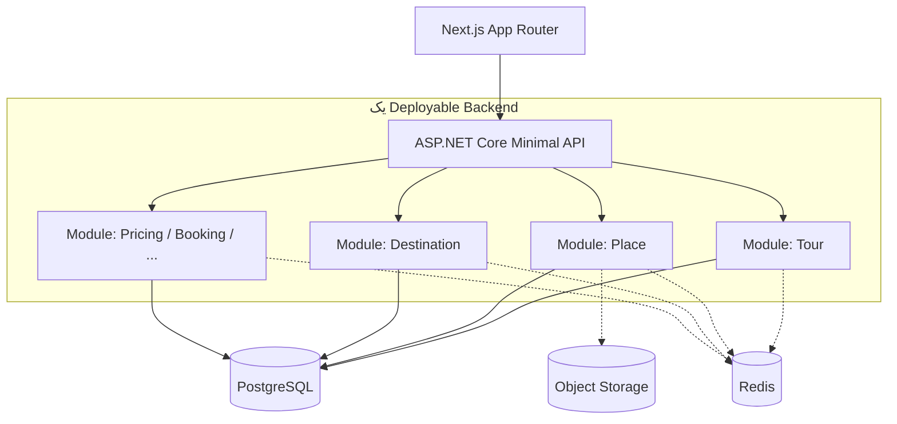

# TravelCore Constitution — قانون اساسی معماری

این سند **اصول قفل‌شده** معماری TravelCore را ثبت می‌کند. بازطراحی این اصول بدون ADR و تأیید معمار مجاز نیست.

گردش‌کار عامل‌ها: [`AGENTS.md`](../../AGENTS.md)
چشم‌انداز محصول: [`01-product-vision.md`](01-product-vision.md)
پایهٔ فناوری: [`02-technology-baseline.md`](02-technology-baseline.md)

---

## 1. شکل سیستم

### تصمیم

TravelCore یک **Modular Monolith** است؛ نه معماری microservices.

### چرا

سادگی عملیاتی یک deployable واحد را می‌خواهیم، در عین حفظ مرزهای دامنه تا ماژول‌ها مستقل تکامل یابند.

### رفتار درست

- یک Backend Application قابل استقرار
- مرزهای داخلی قوی بین ماژول‌ها
- Vertical Slice + Clean Domain Boundaries داخل مونولیت

### رفتار ممنوع

- تجزیهٔ زودهنگام به microservices
- تبدیل شدن به layered «big ball of mud» بدون مالکیت دامنه



---

## 2. جهت وابستگی لایه‌ها

```text
Domain
  ↑
Application
  ↑
Infrastructure
  ↑
API / Presentation
```

### Domain نباید وابسته باشد به

ASP.NET Core، EF Core، Dapper، Redis، HTTP، Next.js، serialization frameworkها، یا جزئیات پیاده‌سازی دیتابیس.

Entityهای دامنه نباید framework-dependent باشند.

---

## 3. مدل‌ها یکی نیستند

| مفهوم | نقش |
|-------|-----|
| Domain Model | قواعد و معنای کسب‌وکار |
| Persistence Model | نگاشت ذخیره‌سازی |
| API Contract | قرارداد معنایی بین کلاینت و سرور |
| Page View Model | نیازهای ارائه در UI |

شباهت ساختاری گاه‌گاه وجود دارد؛ این آن‌ها را یکی نمی‌کند.

**ممنوع:** افشای مستقیم EF Entity از Public API.
**ممنوع:** مفاهیم layout در API مثل `rightColumn`، `leftBox`، `desktopSidebar`.

---

## 4. نقشهٔ ماژول‌های مفهومی

### Foundation / Business Identity

Identity · Access · Party · ReferenceData

### Discovery

Destination · Place · Media

### Knowledge / Community

Content · UGC

### Commerce

Tour · Pricing · Visa · Booking · Payment

### External Inventory / Booking

HotelBooking · Flight

### Platform Capabilities

Search · SEO · Notification

### سطوح Presentation (ماژول دامنه نیستند)

Public Website · Admin Panel · Agency Panel

این سطوح قابلیت‌های Application ماژول‌ها را مصرف می‌کنند؛ منبع حقیقت کسب‌وکار نیستند.

---

## 5. مالکیت ماژول و DbContext

### تصمیم

هر ماژول داده و قواعد کسب‌وکار خود را مالک است. ماژول **نباید** مستقیماً DbContext ماژول دیگر را استفاده کند.

### مثال ممنوع

```csharp
// Forbidden: cross-module EF navigation
public class TourHotelOption
{
    public Hotel Hotel { get; set; } // Hotel متعلق به Place است
}
```

### رفتار درست

```csharp
public class TourHotelOption
{
    public Guid HotelId { get; set; }
}
```

اطلاعات بین‌ماژولی از طریق application contracts، queryهای صریح، projectionها، یا در صورت نیاز integration/event contracts.

---

## 6. Destination هستهٔ Discovery و SEO

سلسله‌مراتب مکان (قابل گسترش بدون بازطراحی کل سیستم):

```text
Continent → Country → Province/State/Region → City → District → Neighborhood
```

مثال: Asia → Turkey → Istanbul → Beyoglu → Taksim

Destination گرهٔ مرکزی گراف کشف و SEO است و می‌تواند به Tours، Hotels، Attractions، Restaurants، Articles، Travelogues، Flights و الزامات Visa متصل شود.

```text
Istanbul
├── Istanbul Tours
├── Istanbul Hotels
├── Istanbul Attractions
├── Istanbul Restaurants
├── Istanbul Travel Guide
├── Istanbul Travelogues
└── Tehran → Istanbul Flights
```

---

## 7. Place در برابر Booking

```text
Place
├── Hotel
├── Restaurant
└── Attraction
```

| مفهوم | سؤال |
|-------|------|
| Hotel Catalog (Place) | این هتل چیست؟ |
| HotelBooking | برای این تاریخ/مسافر با چه نرخ و کنسلی قابل رزرو است؟ |

این دو را ادغام نکنید.

Tour می‌تواند `TourHotelOption` داشته باشد که با `HotelId` به کاتالوگ ارجاع می‌دهد و حقایق تورمحور (شب، MealPlan، ترکیب اتاق/نرخ) را نگه دارد — بدون کپی Entity کاتالوگ داخل Tour.

---

## 8. Tour: دو کهن‌الگوی مهم

Tour یک دامنهٔ غنی است؛ نه فقط Title + Date + Price.

### Experience Tour

تورهای داخلی/طبیعت/ماجراجویی/تجربهٔ هدایت‌شده.

مفاهیم: TourProduct، Itinerary، ItineraryDay، Stop، MealPlan، Accommodation، Local Transportation، Equipment، Difficulty، Eligibility، Services، Policies.

Itinerary نباید به‌صورت پیش‌فرض یک فیلد غول‌پیکر HTML باشد؛ ساختار برای UI، نقشه، SEO و لینک داخلی ارزش دارد.

### Foreign Package Tour

TourProduct + Departures + TransportSegments / FlightSegments + HotelOptions + قواعد اشغال/مسافر + الزامات سفر + Visa/Passport + سیاست‌های کنسلی و پرداخت.

**TourProduct ≠ TourDeparture** — یک محصول می‌تواند چندین Departure زمان‌بندی‌شده داشته باشد.

---

## 9. پول، قیمت و تسویه

### Money

هرگز `float`/`double`. مفهوماً:

```text
Money { Amount: decimal, CurrencyCode }
```

### Multi-currency / Mixed-currency (الزام حیاتی)

یک نرخ تجاری می‌تواند هم‌زمان چند مؤلفه داشته باشد، مثلاً:

```text
Adult in Double Room
1290 USD + 119,900,000 (واحد پول محلی)
```

**ممنوع به‌عنوان مدل بنیادین:** `UsdPrice`، `IrrPrice`، `AdultPrice`، `ChildPrice` به‌عنوان ستون‌های ثابت تک‌ارزی.

مفهوم درست:

```text
TourRate
  └── PriceComponents[]
        Amount · Currency · Purpose/semantic type
```

معماری نباید خاموش همهٔ مؤلفه‌ها را به یک ارز تبدیل کند.

### Price ≠ Quote ≠ Payment

| مفهوم | معنا |
|-------|------|
| Price | اطلاعات نرخ پایه/تجاری |
| Quote | پیشنهاد محاسبه‌شده برای درخواست مشخص در زمان مشخص |
| Booking | باید snapshot قیمت/Quote پذیرفته‌شده را حفظ کند |
| Payment | تسویهٔ مالی واقعی |

تغییر نرخ ارز نباید Bookingهای تاریخی پذیرفته‌شده را mutate کند.

### PassengerCategory ≠ Occupancy

- PassengerCategory: Adult / Child / Infant
- Occupancy: Single / Double / ExtraBed / ChildWithBed / ChildWithoutBed
- AgePolicy مفهوم مرتبط اما جداست

---

## 10. بین‌المللی‌سازی، جهت و مسیر

Locales استراتژیک اولیه: `fa` · `en` · `ar` (قابل گسترش).

**ممنوع:** `NameFa` / `NameEn` / `NameAr` و مشابه برای Description.

سه دستهٔ متمایز:

1. UI Translation
2. Entity Translation
3. Editorial Content Translation

مسیرهای مفهومی: `/fa/...` · `/en/...` · `/ar/...` با slug محلی متفاوت برای همان EntityId.

ترجمهٔ یک locale فقط وقتی منتشر و indexable است که محتوای آن locale منتشر محسوب شود — fallback فارسی را از URL انگلیسی SEO افشا نکنید.

**Locale ≠ Currency ≠ Calendar ≠ Timezone** — مستقل‌اند.

### RTL / LTR

- `fa`/`ar` → `html dir="rtl"`
- `en` → `html dir="ltr"`

نه فقط `body { direction: rtl; }`. ترجیح layout منطقی: `start` / `end` / `inline-start` / `inline-end`.

### Bidi

جهت UI با جهت یک مقدار خاص یکی نیست. مواردی مثل `IKA`، `IST`، `EK978`، `USD`، URL، Email، PassportNumber، BookingReference اغلب منطقاً LTR می‌مانند.

---

## 11. Frontend و UI

- Next.js App Router · TypeScript · Tailwind
- **Server Component first**؛ Client Component فقط برای تعامل واقعی (فیلتر، date picker، نقشه، دیالوگ، booking interaction و …)
- Mobile-first، SEO-first، accessible، multilingual، RTL/LTR-safe

سلسله‌مراتب UI مفهومی:

```text
Design Tokens → Primitives → Composites → Domain Components → Sections → Page Archetypes
```

صفحه فقط یک فایل JSX نیست؛ قبل از پیاده‌سازی صفحات مهم باید purpose، داده، anatomy، responsive، RTL، loading/empty/error، a11y و SEO تعریف شود.

عرض‌های مرجع آینده: 360 · 390 · 768 · 1024 · 1280 · 1440

---

## 12. SEO به‌عنوان قابلیت First-Class

SEO فاز نهایی polish نیست.

مفاهیم پلتفرم (پیاده‌سازی بعداً): SeoRoute، SeoMetadata، Canonical، AlternateLocale/Hreflang، Redirect، IndexPolicy، StructuredData، Sitemap، InternalLink.

Search URL فیلتر (مثل `/fa/tours?destination=istanbul&duration=5`) به‌طور خودکار Landing SEO نیست. Landing کنترل‌شده می‌تواند `/fa/tours/istanbul` باشد. میلیون‌ها ترکیب فیلتر را ایندکس نکنید.

تغییر slug ارزشمند: old → **301** → new canonical. ارزش SEO انباشته را با 404 تصادفی نابود نکنید.

Structured Data باید با معنای واقعی صفحه هم‌خوان باشد؛ یک schema عمومی برای همهٔ صفحات ممنوع است.

Internal linking از روابط معنایی واقعی برمی‌خیزد، نه keyword stuffing.

---

## 13. داده، جستجو، زمان، رسانه

| فناوری | نقش |
|--------|-----|
| PostgreSQL | System of record رابطه‌ای |
| Redis | نه SoR؛ کش/کمک |
| S3-compatible | باینری رسانه |

جستجوی اولیهٔ برنامه‌ریزی‌شده: PostgreSQL FTS + `pg_trgm` پشت abstraction تا بعداً موتور جایگزین/مکمل شود. نرمال‌سازی جستجوی فارسی محتوای editorial مرجع را mutate نکند.

زمان: UTC Instant · Local Date · Local Time · Timezone را قاطی نکنید (مثال: پرواز IKA/IST با timezoneهای جدا؛ check-in هتل به‌عنوان local time-of-day).

رسانه: باینری در object storage؛ متادیتا و مشتقات (original/large/medium/thumbnail · AVIF/WebP) جدا.

---

## 14. رویدادها، Admin، امنیت، Observability

حتی در Modular Monolith، Domain/Application Events برای decouple واکنش‌ها (مثال: `TourPublished` → Search / SEO / Cache / Notification). الگوی **Outbox** برای side effectهای ناهمزمان قابل‌اطمینان برنامه‌ریزی شده است — هنوز پیاده نشود.

**Admin منبع حقیقت نیست**؛ UI ادمین Use Caseهای Application را مصرف می‌کند. از `AdminService` با منطق کپی‌شده پرهیز کنید.

امنیت، observability (Structured Logging، TraceId، CorrelationId، Metrics، Health Checks، Problem Details) و OpenTelemetry در Taskهای Foundation بعدی معرفی می‌شوند — نه در این قانون اساسی به‌عنوان پیاده‌سازی.

---

## 15. سیاست تغییر معماری

تغییرهای معنادار نیاز به ADR دارند؛ از جمله:

- رفتن به microservices
- تغییر مالکیت ماژول
- جایگزینی PostgreSQL
- فلسفهٔ ذخیره‌سازی localization
- استراتژی URL/slug
- معنای Pricing
- مدل ارتباط بین‌ماژولی عمده
- معماری امنیت
- پذیرش framework/کتابخانهٔ بزرگ که معماری را عوض کند

جزئیات فرایند: [`docs/adr/README.md`](../adr/README.md)
