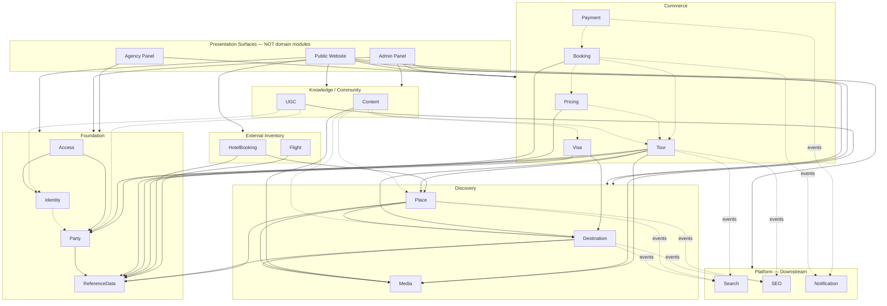

# Domain Map — نقشهٔ دامنه TravelCore

این سند نقشهٔ سطح‌بالای دامنه و جهت مفهومی وابستگی‌ها را تعریف می‌کند.

جزئیات مالکیت هر ماژول: [`04-module-boundaries.md`](04-module-boundaries.md)
قوانین وابستگی: [`05-dependency-rules.md`](05-dependency-rules.md)
ارتباط بین‌ماژولی: [`06-cross-module-communication.md`](06-cross-module-communication.md)
ماتریس سریع: [`../domain/module-ownership-matrix.md`](../domain/module-ownership-matrix.md)

---

## اصل پایه

TravelCore یک **Modular Monolith** با یک Backend deployable است.

اما:

- یک process ≠ یک Domain Model واحد
- یک PostgreSQL ≠ مالکیت همهٔ جداول توسط همه
- یک process ≠ اجازهٔ coupling داخلی مستقیم

---

## دسته‌بندی ماژول‌ها

### Foundation / Business Identity

Identity · Access · Party · ReferenceData

### Discovery

Destination · Place · Media

### Knowledge / Community

Content · UGC

### Commerce

Tour · Pricing · Visa · Booking · Payment

### External Inventory / Booking

HotelBooking · Flight

### Platform Capabilities (downstream)

Search · SEO · Notification

### Presentation Surfaces (ماژول دامنه نیستند)

Public Website · Admin Panel · Agency Panel

این سطوح فقط Application capabilityهای ماژول‌ها را مصرف می‌کنند. منطق کسب‌وکار را مالک نیستند.

---

## Domain Map Diagram



خطوط توپر ≈ وابستگی مفهومی مجاز برای مالکیت/ارجاع.
خطوط نقطه‌چین ≈ قرارداد/رویداد/ارجاع شناسه — نه FK اجباری و نه DbContext مشترک.

---

## تمایز Business در برابر Platform

| نوع | نقش |
|-----|-----|
| Business / Foundation / Discovery / Knowledge / Commerce / External | منبع حقیقت دامنه‌ای یا کاتالوگ/رزرو |
| Platform (Search / SEO / Notification) | قابلیت پایین‌دستی مشتق‌شده |

### اصل حیاتی

ماژول‌های هسته برای صحت تراکنش اصلی‌شان به Search / SEO / Notification وابسته نیستند.

مثال:

```text
Tour published / changed
  ├── Search reacts (projection)
  ├── SEO reacts (invalidation / route mechanics)
  └── Notification may react

Tour does NOT call SearchDbContext
Tour does NOT call SeoDbContext
Tour does NOT send SMS itself
```

اگر Search موقتاً در دسترس نباشد، تراکنش انتشار Tour (در صورت برقراری invariant خودش) معتبر می‌ماند؛ بازیابی eventual برای projection جداگانه است.

---

## جهت مفهومی وابستگی (خلاصه)

```text
Foundation ← Discovery ← Knowledge / Commerce / External
                              ↓ events / contracts
                         Platform (Search, SEO, Notification)
```

Presentation فقط از بالا ترکیب می‌کند؛ مالک دامنه نیست.

---

## Composition ≠ Ownership

صفحهٔ عمومی ممکن است دادهٔ چند ماژول را نشان دهد.

مثال Destination Landing:

```text
Destination
+ Tour cards
+ Hotel/Place cards
+ Content
+ UGC
+ SEO information
```

این ترکیب **مالکیت** را به Destination منتقل نمی‌کند. ترکیب در لایهٔ Presentation / API / read model انجام می‌شود.

---

## وضعیت ADR

در زمان نگارش این سند، فقط فرایند ADR در `docs/adr/README.md` وجود دارد؛ هنوز ADR تصمیم‌گیری‌شدهٔ Accepted ثبت نشده است.
