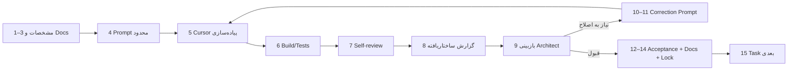

# گردش‌کار توسعه با AI در TravelCore

این سند **چرخهٔ رسمی** همکاری Architect، Cursor، تست‌های خودکار و بازبینی را تعریف می‌کند. قرارداد عملیاتی عامل‌ها: [`../../AGENTS.md`](../../AGENTS.md)

---

## نقش‌ها

| نقش | مسئولیت |
|-----|---------|
| Architect | تحلیل، مشخصات، بازبینی معماری/دامنه/UI/SEO |
| Cursor | پیاده‌ساز اصلی طبق Prompt محدود |
| Hermes | بازبین مستقل / audit |
| Automated Tests | دروازهٔ عینی کیفیت |

قانون: **One Task → One Writer** — دو agent هم‌زمان بدون هماهنگی صریح روی یک Feature ننویسند.

---

## چرخهٔ رسمی



1. Architect فیچر/صفحه را تحلیل می‌کند.
2. تصمیم‌های معماری/دامنه/UI/SEO مشخص می‌شوند.
3. مستندات مرتبط به‌روز می‌شوند.
4. Prompt محدود صادر می‌شود (`docs/prompts/`).
5. Cursor **فقط همان Task** را پیاده می‌کند.
6. Cursor build/testهای مرتبط را اجرا می‌کند.
7. Cursor خودبازبینی می‌کند.
8. Cursor گزارش نهایی ساختاریافته می‌دهد.
9. Architect پیاده‌سازی را بررسی می‌کند.
10. در صورت نیاز، Correction Prompt صادر می‌شود.
11. Cursor **فقط** موارد مشخص‌شده را اصلاح می‌کند.
12. Acceptance gate پاس می‌شود.
13. مستندات به‌روز می‌شوند.
14. Task قفل می‌شود.
15. Task بعدی آغاز می‌شود.

---

## سطوح تصمیم و آزادی Agent

| سطح | نمونه | اختیار Agent |
|-----|-------|--------------|
| Level 1 Architecture | Modular Monolith | ممنوع بدون ADR |
| Level 2 Domain | TourProduct ≠ TourDeparture | طبق مستند؛ تغییر نیاز به معمار/ADR |
| Level 3 Feature Design | نمایش HotelOptions در صفحه | فقط طبق مشخصات Task |
| Level 4 Implementation | نام متد داخلی | آزادی معقول |

اگر Agent بهبود معماری ببیند:

1. پیاده نکند
2. در گزارش تحت **Architectural Concern** بنویسد
3. شواهد و اثر را توضیح دهد
4. منتظر تصمیم معمار / ADR بماند

---

## قالب Traceability

شناسهٔ Task:

```text
TC-P03-T005
```

معنی: TravelCore · Phase 03 · Task 005

Promptها در `docs/prompts/` ذخیره می‌شوند. قالب استاندارد: [`../prompts/README.md`](../prompts/README.md)

نمونه پیام commit پیاده‌سازی:

```text
feat(destination): add localized public detail [TC-P05-T004]
```

هر commit نگهداری جزئی مجبور به این قالب نیست؛ اما Taskهای پیاده‌سازی باید قابل ردیابی باشند.

---

## فلسفهٔ Definition of Done

بسته به ماهیت Task، DoD می‌تواند شامل این ابعاد باشد:

Architecture · Domain invariants · Validation · Authorization · Migration · API contract · OpenAPI · Unit/Integration/Architecture tests · Localization · RTL/LTR · Bidi · Mobile · Desktop · Loading/Empty/Error · Accessibility · SEO · Performance · Documentation

هر Task داخلی همهٔ آیتم‌ها را لازم ندارد؛ اما ابعاد مرتبط نباید فراموش شوند.

---

## تغییر معماری

تغییر معنادار → ADR. فرایند: [`../adr/README.md`](../adr/README.md)

Agent به‌صورت خودسرانه معماری را عوض نمی‌کند.

---

## چندماشینه و همگام‌سازی Git

TravelCore ممکن است از چند ماشین توسعه داده شود.

هویت کاننیکال ریپو:

```text
mrnikiemami-code/TravelCore
```

ریشهٔ محلی را با مسیر ثابت ماشین فرض نکنید؛ کشف کنید با:

```text
git rev-parse --show-toplevel
```

### قبل از شروع Task پیاده‌سازی

1. وضعیت working tree را بررسی کنید (`git status`).
2. branch را تأیید کنید (`main` مگر Task خلاف آن بگوید).
3. `git fetch origin` را اجرا کنید.
4. در صورت نیاز، با **fast-forward فقط** همگام شوید (`git pull --ff-only` وقتی behind هستید).
5. هرگز تاریخچهٔ remote/local را با `reset --hard`، rebase تحمیلی، یا `push --force` بازنویسی نکنید مگر دستور صریح Task/مالک پروژه.

### بعد از Task پیاده‌سازی پذیرفته‌شده

1. Commit کنید.
2. `git push` کنید (بدون force).
3. تأیید کنید `origin/main` شامل commit پذیرفته‌شده است.

اگر تاریخچه‌ها diverge شدند: متوقف شوید، گزارش دهید، و بدون تعمیر خودکار منتظر تصمیم بمانید.
